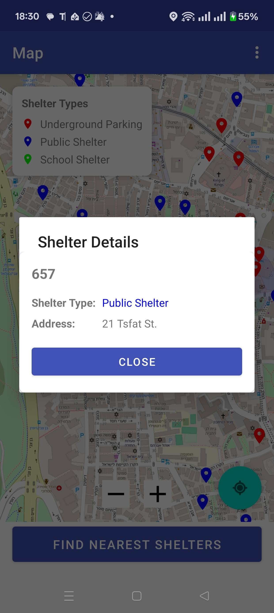
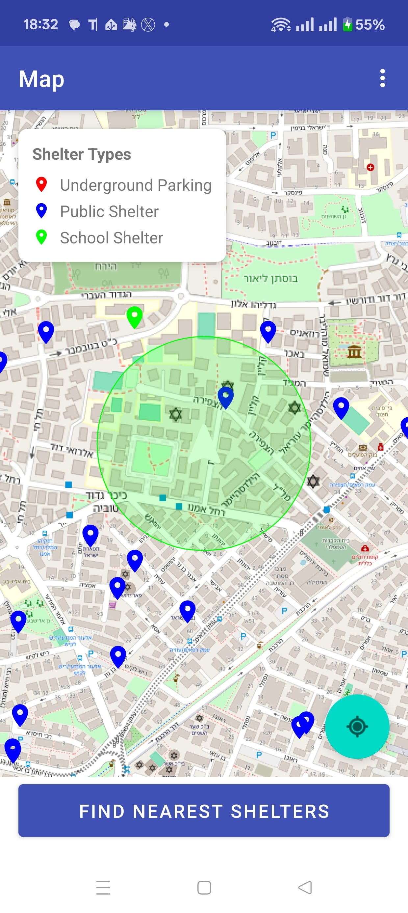
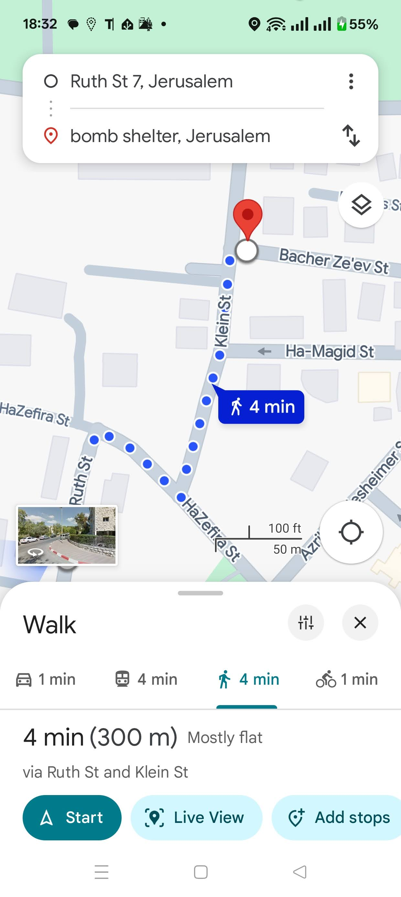

# Jerusalem Shelter Finder

**⚠️ IMPORTANT: This is a NON-OFFICIAL application ⚠️**

This Android application helps users find nearby emergency shelters in Jerusalem. The shelter data was collected from Jerusalem Municipality public records in early June 2025. While efforts have been made to ensure accuracy, this app should not be considered an official source of emergency information.

## App Purpose

During emergency situations, finding the nearest shelter quickly can be critical. This app was developed to:

1. Help Jerusalem residents and visitors locate nearby emergency shelters
2. Provide clear categorization of different shelter types
3. Offer navigation assistance to reach shelters efficiently
4. Present shelter information in an accessible, user-friendly format

## Screenshots

    
    
    

## Features

- **Interactive Map**: Display emergency shelters on a map with different icons based on shelter category
- **Nearest Shelter Finder**: Find the 10 nearest shelters based on your current location
- **Detailed Information**: View comprehensive details about each shelter including name, address, and distance
- **Navigation Integration**: Navigate to shelters using Google Maps with a single tap
- **Shelter Categories**: Easily distinguish between different shelter types (public shelters, underground parking lots, school shelters)
- **Distance Calculation**: See how far each shelter is from your current location

## Shelter Categories

The app categorizes shelters into different types, each with a distinct marker color:
- **Red**: Protected Underground Parking Lots
- **Blue**: Public Shelters
- **Green**: Public Shelters at Schools

## Data Source

The shelter data was collected from Jerusalem Municipality public records in early June 2025. The app uses a GeoJSON file containing emergency shelter locations with the following information:

- Name
- Address
- Category
- Geographic coordinates

## Technical Details

- Built with Kotlin for Android
- Uses OpenStreetMap for mapping functionality
- Implements MVVM architecture with Repository pattern
- Uses Navigation Component for fragment navigation
- Loads shelter data from GeoJSON file

## Setup Instructions

### Prerequisites

- Android Studio Arctic Fox (2020.3.1) or newer

### Configuration

1. Clone the repository
2. Build and run the application

## Disclaimer

This application is provided for informational purposes only. In case of emergency, always follow official instructions from local authorities. The developers make no guarantees regarding the accuracy, completeness, or reliability of the shelter data.

## License

This project is open source and available under the MIT License.
